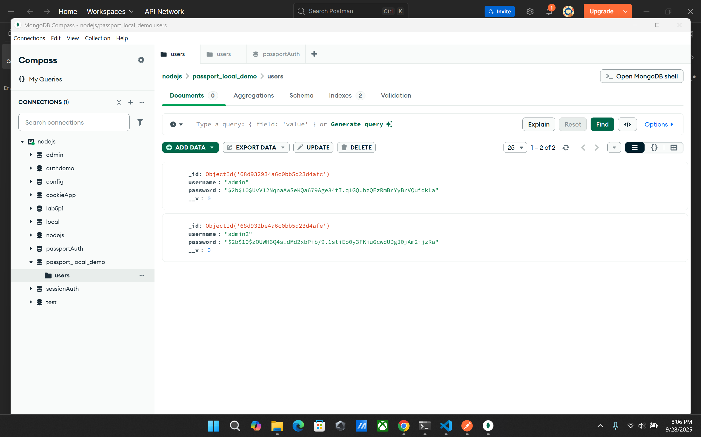

# Local Passport Auth Service

## Giới thiệu
Ứng dụng này minh họa xác thực người dùng với PassportJS, session và MongoDB, cung cấp các API xác thực cơ bản.

## Cách sử dụng và test API

### 1. Khởi động server
```bash
npm install
node app.js
```
Server mặc định chạy ở cổng 3000.

### 2. Các endpoint chính
- **POST /auth/register**: Đăng ký tài khoản mới.
- **POST /auth/login**: Đăng nhập tài khoản.
- **GET /auth/profile**: Xem thông tin cá nhân (cần đăng nhập).
- **GET /auth/logout**: Đăng xuất.

### 3. Test API bằng Postman hoặc trình duyệt
- Đăng ký: Gửi POST tới `/auth/register` với `{ email, password }`.
- Đăng nhập: Gửi POST tới `/auth/login` với `{ email, password }`.
- Xem profile: Gửi GET tới `/auth/profile` (cần đăng nhập, cookie/session sẽ được lưu).
- Đăng xuất: Gửi GET tới `/auth/logout`.

### 4. Hình ảnh minh họa
Các hình ảnh minh họa kết quả test API nằm trong thư mục `public/results`:

#### Đăng ký tài khoản


#### Đăng nhập


#### Xem profile



#### Xem session


#### Đăng xuất


